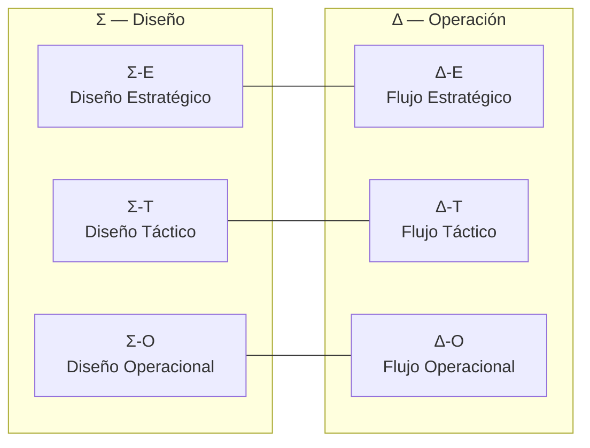

# ASTA‑Kore — Fundamentos y Manual Operacional

> Un marco parsimonioso para la acción coherente en organizaciones complejas.

- **Qué es:** Arquitectura Socio‑Técnica Adaptativa. "Kore" alude al núcleo esencial: el mínimo de principios, artefactos y rituales que habilitan coherencia y aprendizaje continuo.
- **Para quién:** Líderes, arquitectos, equipos de producto/servicio (EVs) y gobernanza.
- **Cómo se usa:** Como un sistema operativo organizacional: modelo mental compartido + protocolos + guías + plataforma (Nexus) + contratos.
- **Parsimonia:** **18 elementos fundamentales** (6 conceptos + 8 artefactos + 4 protocolos) destilados para máxima coherencia y mínima carga cognitiva.

---

## Mapa mental en 30 segundos

La realidad se observa en dos ejes (Σ diseño / Δ operación) y tres niveles (E estratégico / T táctico / O operacional).

- Modelo completo: [Manifiesto](./ASTA-Kore_Manifiesto_Estrategico.md)

---

## Navegación del repositorio

- **Manifiesto (el porqué y el modelo):** [./ASTA-Kore_Manifiesto_Estrategico.md](./ASTA-Kore_Manifiesto_Estrategico.md)
- **Protocolos (el sistema operativo):** [./metodologia refactorizada/protocolos.md](./metodologia refactorizada/protocolos.md)  
  - Calendario CVC 2025: [./metodologia refactorizada/calendario_cvc_2025.md](./metodologia refactorizada/calendario_cvc_2025.md)  
  - PEM (Meta‑protocolo de evolución): [./metodologia refactorizada/protocolo_evolucion.md](./metodologia refactorizada/protocolo_evolucion.md)
  - **Protocolos de Transformación (Cap. 4):**
    - 4.1. Génesis (creación desde cero)
    - 4.2. Metamorfosis (modernización legacy)
    - 4.3. Orquestación (coordinación de múltiples EVs)
      - Variante A: Intra-organizacional (un Nodo de Gobernanza)
      - Variante B: Inter-organizacional (ecosistema federado)
    - 4.5. Adopción Federada (gestión del cambio organizacional)
- **Auditorías del marco:** [./metodologia refactorizada/auditorias/](./metodologia refactorizada/auditorias/)  
  - Ejemplo: [Auditoría Q3 2025](./metodologia refactorizada/auditorias/auditoria_2025_q3.md)
- **Guías de Decisión (7 guías destiladas):** [./guias decision/](./guias decision/)  
  - **Estratégico (Σ-E / Δ-E):**
    - [gd_portafolio.md](./guias decision/gd_portafolio.md) - ¿Nueva EV o expandir existente?
    - [gd_cambio_organizacional.md](./guias decision/gd_cambio_organizacional.md) - ¿Cuándo aplicar Protocolo Adopción Federada?
  - **Táctico (Σ-T / Δ-T):**
    - [gd_arquitectura_nexus.md](./guias decision/gd_arquitectura_nexus.md) - ¿Qué patrón arquitectónico usar?
    - [gd_datos.md](./guias decision/gd_datos.md) - ¿Cómo diseñar Producto de Datos?
    - [gd_sistemas_cognitivos.md](./guias decision/gd_sistemas_cognitivos.md) - ¿Cómo diseñar Sistema Cognitivo (IA)?
    - [gd_mvp.md](./guias decision/gd_mvp.md) - ¿Qué incluir en Esqueleto Andante?
    - [gd_priorizacion.md](./guias decision/gd_priorizacion.md) - ¿En qué capacidad invertir primero?
  - **Operacional (Σ-O / Δ-O):**
    - [gd_automatizacion_proceso.md](./guias decision/gd_automatizacion_proceso.md) - ¿API, RPA o BPA?
  - 📋 [MIGRACION_GUIAS.md](./guias decision/MIGRACION_GUIAS.md) - Registro de guías eliminadas/destiladas
- **Guías Técnicas (implementación):** [./guias tecnicas/](./guias tecnicas/)  
  - Ej.: [gt_arquitectura_nexus.md](./guias tecnicas/gt_arquitectura_nexus.md), [gt_ingenieria_software.md](./guias tecnicas/gt_ingenieria_software.md)
- **Contratos (fuente única de verdad operable):** [./contratos/](./contratos/)  
  - Contrato de Proceso (Especificación): [./contratos/contrato_proceso.md](contratos/procesos/contrato_proceso.md)  
  - Contrato de Proceso (Plantilla YAML): [./contratos/contrato_proceso.yml](contratos/procesos/contrato_proceso.yml)
- **Ontología y adopción:** [./metodologia refactorizada/ontologia.md](./metodologia refactorizada/ontologia.md) · [./metodologia refactorizada/adopcion.md](./metodologia refactorizada/adopcion.md)
- **Catálogo (artefactos, EVs, tableros):** [./metodologia refactorizada/catalogo.md](./metodologia refactorizada/catalogo.md)

---

## Núcleo Parsimonioso (18 elementos)

### 6 Conceptos Fundamentales

1. **Matriz de Coherencia (Σ/Δ × E/T/O):** Modelo mental de 6 celdas para observar diseño y operación
2. **Entidad de Valor (EV):** Unidad sociotécnica con propósito, fronteras contractuales y métricas de desempeño
3. **Contrato:** Acuerdo explícito versionado entre EVs (tipos: Datos, API, Agente, Proceso)
4. **Nodo de Gobernanza (NG):** Responsable de decisiones estratégicas (federación opcional para ecosistemas complejos)
5. **Ciclo de Retroalimentación:** Patrón universal (Medir→Identificar→Intervenir→Verificar) con instancias a múltiples escalas
6. **Canvas de EV:** Mapa vivo de la anatomía de una EV (incluye OKRs activos en Caja 9)

### 8 Artefactos Operacionales

**Estratégico (Σ-E / Δ-E):**

1. Mapa de Capacidades
2. Informe de CVC

**Táctico (Σ-T / Δ-T):**
3. Canvas de EV (con OKRs activos)
4. Mapeo de Historias
5. Mapa de Stakeholders

**Operacional (Σ-O / Δ-O):**
6. Contrato (tipos: Datos, API, Agente, Proceso)
7. ADR (referencia Contratos cuando define interfaces)
8. Tablero de Flujo (con límites WIP)

### 4 Protocolos de Transformación

1. **Génesis:** Creación desde cero (MVT + Esqueleto Andante)
2. **Metamorfosis:** Modernización legacy (Strangler Fig Pattern)
3. **Orquestación:** Coordinación de múltiples EVs (variantes intra/inter-organizacional)
4. **Adopción Federada:** Gestión del cambio organizacional (transparencia radical + olas de adopción)

---

## Qué hacer según tu rol

- **Líderes y Gobernanza**
  - Leer el [Manifiesto](./ASTA-Kore_Manifiesto_Estrategico.md) y Cap. 1–2 de [Protocolos](./metodologia refactorizada/protocolos.md).
  - Usar el [Calendario CVC 2025](./metodologia refactorizada/calendario_cvc_2025.md) para planificar y exigir evidencia en las decisiones.

- **Equipos de EV**
  - Modelar su EV en el `Canvas` y formular 1–2 OKRs trimestrales. Ver Cap. 2 de [Protocolos](./metodologia refactorizada/protocolos.md) y [Catálogo](./metodologia refactorizada/catalogo.md).
  - Si tu flujo es automatizado, acompañarlo con [Contrato de Proceso](contratos/procesos/contrato_proceso.md) + [YAML](contratos/procesos/contrato_proceso.yml).

- **Arquitectos/Ingeniería**
  - Decidir con Guías de Decisión (p.ej. [gd_arquitectura_nexus.md](./guias decision/gd_arquitectura_nexus.md)).
  - Implementar con Guías Técnicas (p.ej. [gt_ingenieria_software.md](./guias tecnicas/gt_ingenieria_software.md)).

- **Líderes de Cambio Organizacional**
  - Usar [Guía de Decisión: Gestión del Cambio](./guias decision/gd_cambio_organizacional.md) para determinar si aplicar el Protocolo "Adopción Federada".
  - Construir el [Mapa de Stakeholders](./metodologia refactorizada/catalogo.md#plantilla-a23-mapa-de-stakeholders-σ-t) y diseñar Roadmap de Adopción por Olas.
  - Gestionar mediante transparencia radical: Observatorio de Adopción + rituales "Show & Tell" en CVC.

---

## CVC: el ritual que cierra el bucle

- Ritmo trimestral, evidencia primero (OKRs, demo, salud del sistema). Decisión explícita de inversión por el NFG.
- Referencias: Cap. 2.3 en [Protocolos](./metodologia refactorizada/protocolos.md) y [Calendario CVC 2025](./metodologia refactorizada/calendario_cvc_2025.md).

---

## Policy‑as‑Contract (principio operativo)

- La gobernanza vive en los pipelines: las políticas automatizadas validan la existencia y validez de contratos versionados (p.ej., [contrato_proceso.yml](contratos/procesos/contrato_proceso.yml)).
- Los catálogos y paneles son vistas materializadas de lo que declaran esos contratos en los repositorios.

---

## Evolución del marco (PEM)

- El marco se audita y adapta con un ciclo anual formal (y on‑demand por evidencia).
- Ver: [PEM](./metodologia refactorizada/protocolo_evolucion.md) y registros en [auditorías](./metodologia refactorizada/auditorias/).

---

## Empezar en 30 minutos

1. Leer el [Manifiesto](./ASTA-Kore_Manifiesto_Estrategico.md) (Σ/Δ × E/T/O).
2. Crear/actualizar el `Canvas` de tu EV y formular 1–2 OKRs trimestrales. Ver [Protocolos](./metodologia refactorizada/protocolos.md) → Cap. 2.
3. Si tu flujo es automatizado, generar [Contrato de Proceso](contratos/procesos/contrato_proceso.md) + [YAML](contratos/procesos/contrato_proceso.yml) y enlazarlo en tu repo.

---

## Glosario Rápido

- **EV:** Entidad de Valor (átomo del valor organizacional)
- **Contrato:** Acuerdo explícito versionado (YAML/JSON) que define interacciones
- **ADR:** Bitácora de Decisión Arquitectónica (combate amnesia organizacional)
- **CVC:** Ciclo de Valor y Capacidad (ritual trimestral de gobernanza basado en evidencia)
- **NG:** Nodo de Gobernanza (toma decisiones de inversión)
- **Nexus:** Plataforma de referencia ("carreteras pavimentadas" + guardrails)
