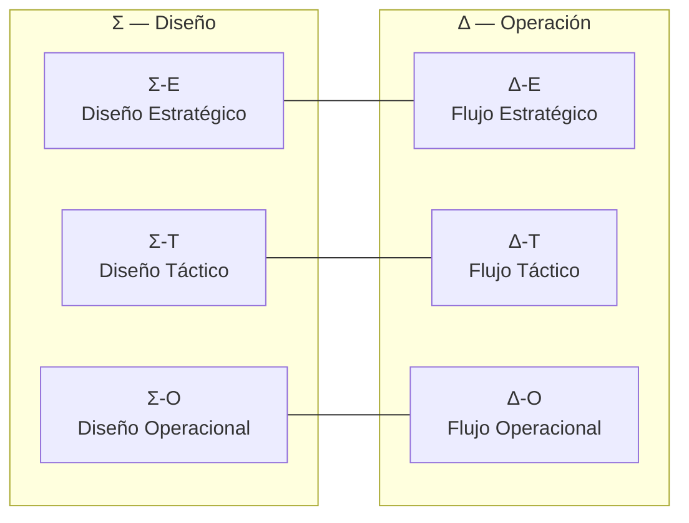

# ASTA‑Kore — Fundamentos y Manual Operacional

> Un marco parsimonioso para la acción coherente en organizaciones complejas.

- **Qué es:** Arquitectura Socio‑Técnica Adaptativa. “Kore” alude al núcleo esencial: el mínimo de principios, artefactos y rituales que habilitan coherencia y aprendizaje continuo.
- **Para quién:** Líderes, arquitectos, equipos de producto/servicio (EVs) y gobernanza.
- **Cómo se usa:** Como un sistema operativo organizacional: modelo mental compartido + protocolos + guías + plataforma (Nexus) + contratos.

---

## Mapa mental en 30 segundos

La realidad se observa en dos ejes (Σ diseño / Δ operación) y tres niveles (E estratégico / T táctico / O operacional).

- Modelo completo: [Manifiesto](./ASTA-Kore_Manifiesto_Estrategico.md)

---

## Navegación del repositorio

- **Manifiesto (el porqué y el modelo):** [./ASTA-Kore_Manifiesto_Estrategico.md](./ASTA-Kore_Manifiesto_Estrategico.md)
- **Protocolos (el sistema operativo):** [./metodologia refactorizada/protocolos.md](./metodologia refactorizada/protocolos.md)  
  - Calendario CVC 2025: [./metodologia refactorizada/calendario_cvc_2025.md](./metodologia refactorizada/calendario_cvc_2025.md)  
  - PEM (Meta‑protocolo de evolución): [./metodologia refactorizada/protocolo_evolucion.md](./metodologia refactorizada/protocolo_evolucion.md)
- **Auditorías del marco:** [./metodologia refactorizada/auditorias/](./metodologia refactorizada/auditorias/)  
  - Ejemplo: [Auditoría Q3 2025](./metodologia refactorizada/auditorias/auditoria_2025_q3.md)
- **Guías de Decisión (estratégicas):** [./guias decision/](./guias decision/)  
  - Ej.: [gd_arquitectura_nexus.md](./guias decision/gd_arquitectura_nexus.md), [gd_automatizacion_proceso.md](./guias decision/gd_automatizacion_proceso.md)
- **Guías Técnicas (implementación):** [./guias tecnicas/](./guias tecnicas/)  
  - Ej.: [gt_arquitectura_nexus.md](./guias tecnicas/gt_arquitectura_nexus.md), [gt_ingenieria_software.md](./guias tecnicas/gt_ingenieria_software.md)
- **Contratos (fuente única de verdad operable):** [./contratos/](./contratos/)  
  - Contrato de Proceso (Especificación): [./contratos/contrato_proceso.md](contratos/procesos/contrato_proceso.md)  
  - Contrato de Proceso (Plantilla YAML): [./contratos/contrato_proceso.yml](contratos/procesos/contrato_proceso.yml)
- **Ontología y adopción:** [./metodologia refactorizada/ontologia.md](./metodologia refactorizada/ontologia.md) · [./metodologia refactorizada/adopcion.md](./metodologia refactorizada/adopcion.md)
- **Catálogo (artefactos, EVs, tableros):** [./metodologia refactorizada/catalogo.md](./metodologia refactorizada/catalogo.md)

---

## Qué hacer según tu rol

- **Líderes y Gobernanza**
  - Leer el [Manifiesto](./ASTA-Kore_Manifiesto_Estrategico.md) y Cap. 1–2 de [Protocolos](./metodologia refactorizada/protocolos.md).
  - Usar el [Calendario CVC 2025](./metodologia refactorizada/calendario_cvc_2025.md) para planificar y exigir evidencia en las decisiones.

- **Equipos de EV**
  - Modelar su EV en el `Canvas` y formular OKRs trimestrales. Ver Cap. 2 de [Protocolos](./metodologia refactorizada/protocolos.md) y [Catálogo](./metodologia refactorizada/catalogo.md).
  - Si tu flujo es automatizado, acompañarlo con [Contrato de Proceso](contratos/procesos/contrato_proceso.md) + [YAML](contratos/procesos/contrato_proceso.yml).

- **Arquitectos/Ingeniería**
  - Decidir con Guías de Decisión (p.ej. [gd_arquitectura_nexus.md](./guias decision/gd_arquitectura_nexus.md)).
  - Implementar con Guías Técnicas (p.ej. [gt_ingenieria_software.md](./guias tecnicas/gt_ingenieria_software.md)).

---

## CVC: el ritual que cierra el bucle

- Ritmo trimestral, evidencia primero (OKRs, demo, salud del sistema). Decisión explícita de inversión por el NFG.
- Referencias: Cap. 2.3 en [Protocolos](./metodologia refactorizada/protocolos.md) y [Calendario CVC 2025](./metodologia refactorizada/calendario_cvc_2025.md).

---

## Policy‑as‑Contract (principio operativo)

- La gobernanza vive en los pipelines: las políticas automatizadas validan la existencia y validez de contratos versionados (p.ej., [contrato_proceso.yml](contratos/procesos/contrato_proceso.yml)).
- Los catálogos y paneles son vistas materializadas de lo que declaran esos contratos en los repositorios.

---

## Evolución del marco (PEM)

- El marco se audita y adapta con un ciclo anual formal (y on‑demand por evidencia).
- Ver: [PEM](./metodologia refactorizada/protocolo_evolucion.md) y registros en [auditorías](./metodologia refactorizada/auditorias/).

---

## Empezar en 30 minutos

1. Leer el [Manifiesto](./ASTA-Kore_Manifiesto_Estrategico.md) (Σ/Δ × E/T/O).
2. Crear/actualizar el `Canvas` de tu EV y formular 1–2 OKRs trimestrales. Ver [Protocolos](./metodologia refactorizada/protocolos.md) → Cap. 2.
3. Si tu flujo es automatizado, generar [Contrato de Proceso](contratos/procesos/contrato_proceso.md) + [YAML](contratos/procesos/contrato_proceso.yml) y enlazarlo en tu repo.

---

## Glosario mínimo

- **EV (Entidad de Valor):** unidad sociotécnica con propósito, fronteras contractuales y métricas de desempeño.
- **Contrato:** acuerdo explícito que rige una interacción (Datos, Proceso, Agente, Conocimiento).
- **ADR:** bitácora de decisión arquitectónica concisa y versionada.
- **Nexus:** arquitectura de referencia que materializa las “carreteras pavimentadas”.

---

¿Sugerencias o mejoras al marco? Usa el [PEM](./metodologia refactorizada/protocolo_evolucion.md) y registra tu auditoría en `./metodologia refactorizada/auditorias/`.